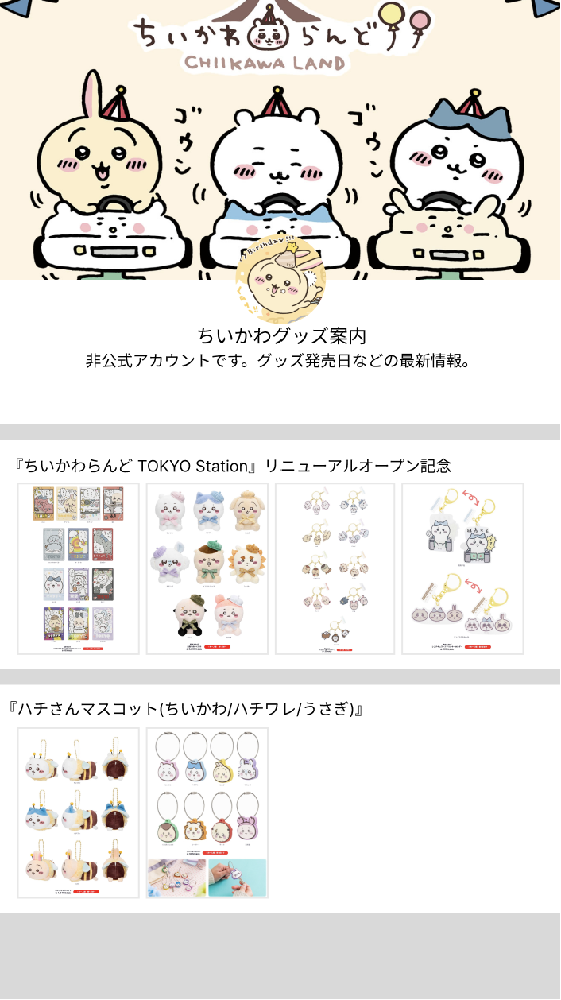

# aboutchiikawa
:bulb: [Github](https://github.com/ouoxii/About-Chiikawa-flutter)


## 1. 一定要使用的widget

`Icon`

```dart
//每個標題有一個小箭頭(三角形)
Row(children: [
  Icon(
	Icons.arrow_right,
  ),
  Text(data)
]),
```
`Column` `Row` `Color`
- SizeBox

```dart
class Info extends StatelessWidget {
  final String data;
  final List<String> imageUrls;

  const Info({
    Key? key,
    required this.data,
    required this.imageUrls,
  }) : super(key: key);

  @override
  Widget build(BuildContext context) {
    List<Widget> imageWidgets = [];

    // 將圖片和間距一起添加到列表中
    for (int i = 0; i < imageUrls.length; i++) {
      imageWidgets.add(
        SizedBox(
          width: 10, // 調整間距的大小
        ),
      );
      imageWidgets.add(
        SizedBox(
          width: 78,
          height: 109,
          child: Image.network(
            imageUrls[i],
            fit: BoxFit.cover,
          ),
        ),
      );
    }

    return Container(
      color: Colors.white,
      width: 360,
      height: 145,
      child: SingleChildScrollView(
        scrollDirection: Axis.horizontal,
        child: Row(
          mainAxisAlignment: MainAxisAlignment.start, // 調整圖片的對齊方式
          children: [
            Column(
              crossAxisAlignment: CrossAxisAlignment.start, // 調整文字的對齊方式
              children: [
                Text(data),
                SizedBox(height: 10),
                Row(
                  children: imageWidgets,
                ),
              ],
            ),
          ],
        ),
      ),
    );
  }
}
```

`Stack` `Image`
- Container

```dart
class HeadPic extends StatelessWidget {
  const HeadPic({
    super.key,
  });

  @override
  Widget build(BuildContext context) {
    return Stack(
      alignment: Alignment.topCenter,
      children: [
        Container(
          color: Colors.white,
          width: 360,
          height: 272,
        ),
        Positioned(//封面圖片
          top: 0,
          child: Image.network(
              'https://www.chiikawa-info.jp/chiikawaland/tokyo/img/main_02.jpg',
              width: 360,
              height: 180,
              fit: BoxFit.cover),
        ),
        Positioned(//大頭貼
          top: 151,
          right: 151,
          child: Container(
            width: 57,
            height: 57,
            clipBehavior: Clip.antiAlias,
            decoration: BoxDecoration(
              color: Colors.white,
              shape: BoxShape.circle,//圓形切割
            ),
            child: Image.network(
                'https://pbs.twimg.com/profile_images/1762710167614017536/MMn4pafo_400x400.jpg',
                width: 57,
                height: 57,
                fit: BoxFit.cover),
          ),
        ),
        Positioned(
          top: 208,
          child: Container(
          ),
        ),
        Positioned(
          top: 225,
          child: Container(),
        ),
      ],
    );
  }
}

```

`SingleChildScrollView` `Text`
- AppBar

```dart
class MyHomePage extends StatelessWidget {
  final List<Map<String, dynamic>> infos = [//省略]
  @override
  Widget build(BuildContext context) {
    return Scaffold(
      backgroundColor: Color.fromARGB(242, 242, 242, 242),
      appBar: AppBar(
        title: Text('Chiikawa Home Page'),
      ),
      body: SingleChildScrollView(
        scrollDirection: Axis.vertical,
        child: //...
      ),
    );
  }
}
```

2. UI初始設計


- 尺寸: Android Small - 1
- 量圖片之間的間距
- 確定一下想要的效果
- 確定配色